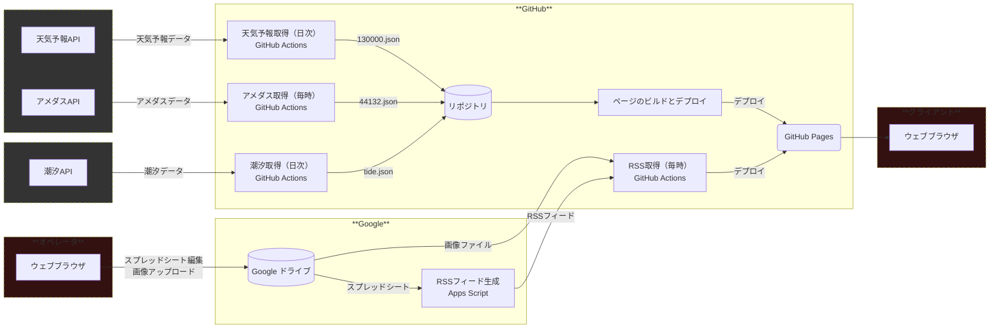

```mermaid
flowchart LR
  subgraph GitHub[**GitHub**]
    repository[(リポジトリ)]
    actions_deploy[ページのビルドとデプロイ]
    actions_forecast[天気予報取得（日次）<br>GitHub Actions]
    actions_amedas[アメダス取得（毎時）<br>GitHub Actions]
    actions_rss[RSS取得（毎時）<br>GitHub Actions]
    actions_tide[潮汐取得（日次）<br>GitHub Actions]
    pages(GitHub Pages)
  end

  subgraph Google[**Google**]
    drive[(Google ドライブ)]
    apps[RSSフィード生成<br>Apps Script]
  end

  subgraph JMA[**気象庁**]
    forecast_api[天気予報API]
    amedas_api[アメダスAPI]
  end
  style JMA fill:#333333, stroke-dasharray: 5 5

  subgraph Tide[**潮汐**]
    tide_api[潮汐API]
  end
  style Tide fill:#333333, stroke-dasharray: 5 5

  subgraph Client[**クライアント**]
    web_browser[ウェブブラウザ]
  end
  style Client fill:#331111, stroke-dasharray: 5 5

  subgraph Operator[**オペレータ**]
    web_browser2[ウェブブラウザ]
  end
  style Operator fill:#331111, stroke-dasharray: 5 5

  repository --> actions_deploy
  actions_deploy -->|デプロイ| pages

  drive -->|スプレッドシート| apps
  drive -->|画像ファイル| actions_rss
  apps -->|RSSフィード| actions_rss
  actions_rss -->|デプロイ| pages

  forecast_api -->|天気予報データ| actions_forecast
  actions_forecast -->|130000.json| repository

  amedas_api -->|アメダスデータ| actions_amedas
  actions_amedas -->|44132.json| repository

  tide_api -->|潮汐データ| actions_tide
  actions_tide -->|tide.json| repository

  pages --> web_browser

  web_browser2 -->|スプレッドシート編集<br>画像アップロード| drive
```