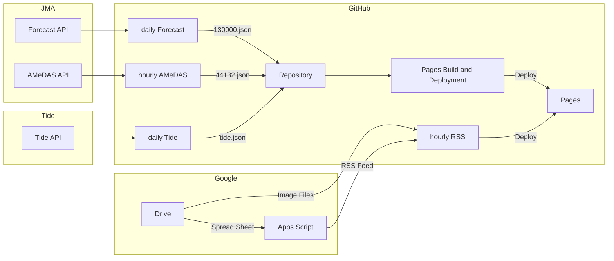

```mermaid
flowchart LR
  subgraph GitHub[GitHub]
    repository[Repository]
    actions_deploy[Pages Build and Deployment]
    actions_forecast[daily Forecast]
    actions_amedas[hourly AMeDAS]
    actions_rss[hourly RSS]
    actions_tide[daily Tide]
    pages[Pages]
  end

  subgraph Google[Google]
    drive[Drive]
    apps[Apps Script]
  end

  subgraph JMA[JMA]
    forecast_api[Forecast API]
    amedas_api[AMeDAS API]
  end

  subgraph Tide[Tide]
    tide_api[Tide API]
  end

  repository --> actions_deploy
  actions_deploy -->|Deploy| pages

  drive -->|Spread Sheet| apps
  drive -->|Image Files| actions_rss
  apps -->|RSS Feed| actions_rss
  actions_rss -->|Deploy| pages

  forecast_api --> actions_forecast
  actions_forecast -->|130000.json| repository

  amedas_api --> actions_amedas
  actions_amedas -->|44132.json| repository

  tide_api --> actions_tide
  actions_tide -->|tide.json| repository
```
