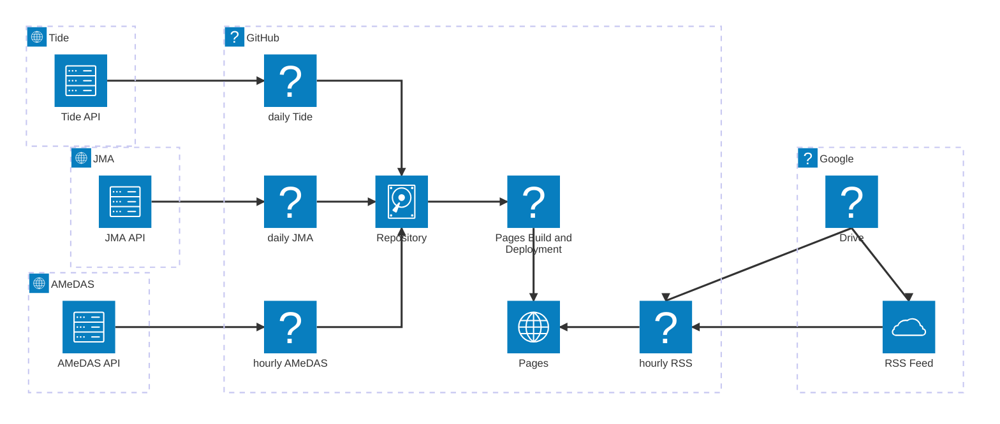

```mermaid
architecture-beta
    group github(logos:github-icon)[GitHub]
    service repository(disk)[Repository] in github
    service actions-deploy(logos:github-actions)[Pages Build and Deployment] in github
    service actions-jma(logos:github-actions)[daily JMA] in github
    service actions-amedas(logos:github-actions)[hourly AMeDAS] in github
    service actions-rss(logos:github-actions)[hourly RSS] in github
    service actions-tide(logos:github-actions)[daily Tide] in github
    service pages(internet)[Pages] in github
    repository:R --> L:actions-deploy
    actions-deploy:B --> T:pages


    group google(logos:google-icon)[Google]
    service drive(logos:google-drive)[Drive] in google
    service apps(cloud)[RSS Feed] in google
    drive:B --> T:apps
    drive:B --> T:actions-rss
    apps:L --> R:actions-rss
    actions-rss:L --> R:pages


    group jma(internet)[JMA]
    service jma-api(server)[JMA API] in jma
    jma-api:R --> L:actions-jma
    actions-jma:R --> L:repository


    group amedas(internet)[AMeDAS]
    service amedas-api(server)[AMeDAS API] in amedas
    amedas-api:R --> L:actions-amedas
    actions-amedas:R --> B:repository


    group tide(internet)[Tide]
    service tide-api(server)[Tide API] in tide
    tide-api:R --> L:actions-tide
    actions-tide:R --> T:repository
```
