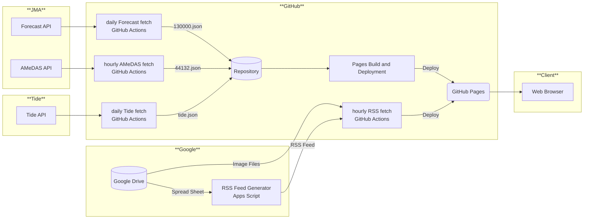

```mermaid
flowchart LR
  subgraph GitHub[**GitHub**]
    repository[(Repository)]
    actions_deploy[Pages Build and Deployment]
    actions_forecast[daily Forecast fetch<br>GitHub Actions]
    actions_amedas[hourly AMeDAS fetch<br>GitHub Actions]
    actions_rss[hourly RSS fetch<br>GitHub Actions]
    actions_tide[daily Tide fetch<br>GitHub Actions]
    pages(GitHub Pages)
  end

  subgraph Google[**Google**]
    drive[(Google Drive)]
    apps[RSS Feed Generator<br>Apps Script]
  end

  subgraph JMA[**JMA**]
    forecast_api[Forecast API]
    amedas_api[AMeDAS API]
  end

  subgraph Tide[**Tide**]
    tide_api[Tide API]
  end

  subgraph Client[**Client**]
    web_browser[Web Browser]
  end

  repository --> actions_deploy
  actions_deploy -->|Deploy| pages

  drive -->|Spread Sheet| apps
  drive -->|Image Files| actions_rss
  apps -->|RSS Feed| actions_rss
  actions_rss -->|Deploy| pages

  forecast_api --> actions_forecast
  actions_forecast -->|130000.json| repository

  amedas_api --> actions_amedas
  actions_amedas -->|44132.json| repository

  tide_api --> actions_tide
  actions_tide -->|tide.json| repository

  pages --> web_browser
```
